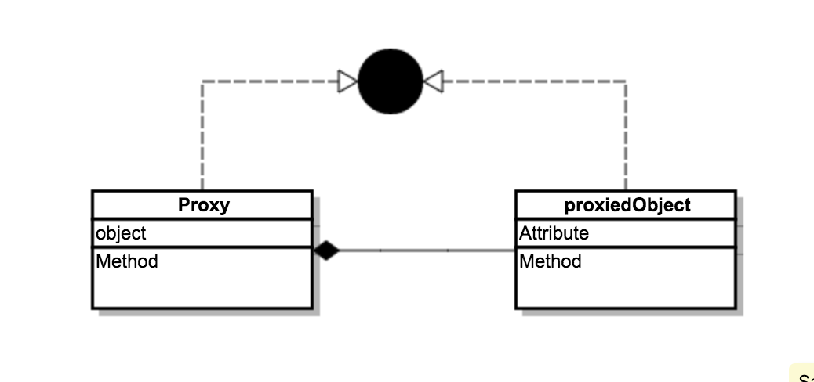

# 20170104


## mysql binlog 初识

binlog根据名字可知是一种日志。如果日志信息丰富就可以做很多事情，比如信息的恢复、主从复制等等。

谁的日志呢？MySQL Server的，不是存储引擎的（innodb、myisam, etc）

### 日志的格式

记log的形式有很多种（完全凭借着业务，或者作者的喜好 >_< ）。目前有3种格式：

* statement

* row

* mix

可以使用如下命令查看当前mysql server的binlog_format是什么格式：

```
show variables like 'binlog_format'
```

或者通过mysql server的配置文件查看binlog_format参数的值。

> statement

对造成修改的sql语句进行直接保存。显然这种比较省空间，应为只保存sql，不对受影响的row进行保存

> row

当执行对数据造成修改的SQL时，不会保存SQL，而是保存受影响的行和结果

> mix

当能使用statement保存时，优先使用statement，不能通过SQL来存储数据时，使用Row

# 20160105

## mysql 5.6 OSX 免安装

mysql 5.5\5.6\5.7 版本在osx上安装的方法还不一样

> 解压到/usr/local/下，并改名为mysql

**主要必须是这个目录，目前bin目录下的shell中都指定了这个目录**


> mysql初识化和设置密码

```
sudo chown -R root:wheel mysql ##这一步还没有搞懂
sudo bin/mysqld --initialize --user=mysql
```

> 启动mysql server

```
# 启动 sudo support-files/mysql.server start 
# 重启 sudo support-files/mysql.server restart 
# 停止 sudo support-files/mysql.server stop 
# 检查 MySQL 运行状态 sudo support-files/mysql.server status
```

还可以安全模式启动

```
bin/mysqld_safe
```

有一个批量删除进程的命令

```
pkill mysqld
```

> 客户端登录

```
bin/mysql -uroot -p
```

## binlog 测试

哈哈，终于到新手测试binlog的环节了

### 首先 查看binlog功能是否开启

```
show variables like 'log_%';
```

如果没有开启，可以在启动的时候指定，或则在配置文件中指定

```
sudo bin/mysqld_safe --log-bin=mysql-bin ## mysql-bin是binlog的前缀
```

### 查看binlog的格式

```
show variables like 'binlog_format'
```

binlog的格式受到事务隔离级别的影响

在mysql5.1、5.5、5.6、5.7中，当事务的隔离级别为`READ_COMMITTED`时，及时binlog_format 为mixed，也会变成row的格式

### 查看binlog

有两种方式

* 在mysql client中查看 【首选】

```
mysql> show binlog events;
```

这里可以看成一张表，可以指定where limit 

结果如下：

```
+------------------+-----+-------------+-----------+-------------+----------------------------------------------------------------------------+
| Log_name         | Pos | Event_type  | Server_id | End_log_pos | Info                                                                       |
+------------------+-----+-------------+-----------+-------------+----------------------------------------------------------------------------+
| mysql-bin.000001 |   4 | Format_desc |         1 |         120 | Server ver: 5.6.35-log, Binlog ver: 4                                      |
| mysql-bin.000001 | 120 | Query       |         1 |         256 | use `test`; create table test(name text)engine=innodb default charset=utf8 |
| mysql-bin.000001 | 256 | Query       |         1 |         335 | BEGIN                                                                      |
| mysql-bin.000001 | 335 | Query       |         1 |         443 | use `test`; insert into test values('a'),('b')                             |
| mysql-bin.000001 | 443 | Xid         |         1 |         474 | COMMIT /* xid=20 */                                                        |
| mysql-bin.000001 | 474 | Query       |         1 |         590 | use `test`; alter table test add column gender char(1)                     |
| mysql-bin.000001 | 590 | Query       |         1 |         669 | BEGIN                                                                      |
| mysql-bin.000001 | 669 | Query       |         1 |         769 | use `test`; update test set gender='f'                                     |
| mysql-bin.000001 | 769 | Xid         |         1 |         800 | COMMIT /* xid=25 */                                                        |
+------------------+-----+-------------+-----------+-------------+----------------------------------------------------------------------------+
```

* 通过binlog脚本

```
/bin/mysqlbinlog mysql-bin.000001 ##后面是binlog的文件名
```

这种方式是纯文本的，看起来不太友好


# 20170108

## `pthread_mutex_lock`/ `pthread_mutex_unlock` 函数

在系统级别，多线程的管理是通过系统函数控制的。这个应该属于C++的范畴，大概的了解一下

这里有个资料: <a href="http://docs.oracle.com/cd/E19253-01/819-7051/6n919hpag/index.html">http://docs.oracle.com/cd/E19253-01/819-7051/6n919hpag/index.html</a>

java里面多线程很多也涉及到了调用系统函数。

> Unsafe.park() / Unsafe.unpark()


# 20170121

## SynchronousQueue

queue 很多场景是用来解耦的，实现异步，也能实现不同线程、进程间的关联（通信）


# 20170322

## JDK 动态代理

动态代理和静态代理在设计模式上都是一样的。 实现一个接口，并且包含一个要代理的对象（实现相同的接口）。



动态代理也是基于这种设计模式来的。但为什么叫“动态”呢？

“动态”就是不用为每一个要代理的对象”手动“写一个代理类。当然“不手动”是需要机器帮忙完成的。JDK自带的动态代理功能，就是用java程序生成java字节码文件，使用用户传进去的classloader进行实时加载。

我们先看一个使用JDK实现动态代理的例子：

```
/**
 * 定义一个接口
 */
public interface Animal {
	public String name();
}

/**
 * 一个实现类，同时要作为被代理的对象的class
 */
public class Dog implements Animal {
	@Override
	public String name() {
		return "dog";
	}
}

/**
 * 定义一个Invoker, 用来代理一个方法
 */
public class Invoker implements InvocationHandler {

	public static final Logger LOG = LoggerFactory.getLogger(Invoker);

	private Object proxiedObject;

	public Invoker(Object proxiedObject) {
		proxiedObject = proxiedObject;
	}

	@Override
	public Object invoke(Object proxy, Method method, Object[] args) throws Throwable {
		LOG.info("before");
		Object result = method.invoke(proxiedObject, args);
		LOG.info("after");
		return result;
	}
}

/**
 * 测试类
 /
public class Testor {
	public static void main(String[] args) {
		Animal dog = new Dog();
		InvocationHandler handler = new Invoker(dog);
	    System.setProperty("sun.misc.ProxyGenerator.saveGeneratedFiles", "true");
		Animal dog2 = (Animal) Proxy.newProxyInstance(Animal.class.getClassLoader(), dog.getClass().getInterfaces(), handler);
		dog2.name();
	}
}
```

其中：

* Proxy.newProxyInstance 方法，会生成一个实现了用户指定接口的class文件， 然后生成这个class的实例。

class文件的字节码是怎么生成的？

```
/**
     * A factory function that generates, defines and returns the proxy class given
     * the ClassLoader and array of interfaces.
     */
    private static final class ProxyClassFactory
        implements BiFunction<ClassLoader, Class<?>[], Class<?>>
    {
        @Override
        public Class<?> apply(ClassLoader loader, Class<?>[] interfaces) {
        
			//生成字节码
            byte[] proxyClassFile = ProxyGenerator.generateProxyClass(
                proxyName, interfaces, accessFlags);
```

生成字节码的详细过程，可以 ProxyGenerator 类。

如果想通过反编译查看生成的java字节码文件，可以指定 “sun.misc.ProxyGenerator.saveGeneratedFiles” 保存生成的字节码文件。（这个逻辑可以在ProxyGenerator中找到）

```
System.setProperty("sun.misc.ProxyGenerator.saveGeneratedFiles", "true");
```

生成的新文件包名是什么？

默认会在项目的根目录内生成文件，文件夹是包名。如果传入的接口是public类型的，生成的包名是 "com/sun/proxy/"；如果是非public类型的，包名取的是最后一个interface的包名。

新文件名是什么？

$Proxy${Number}。结尾的${Number} 是一个全局变量，逐渐递增。

我们使用jad反编译产生的字节文件：

```
// Decompiled by Jad v1.5.8g. Copyright 2001 Pavel Kouznetsov.
// Jad home page: http://www.kpdus.com/jad.html
// Decompiler options: packimports(3) 

package com.sun.proxy;

import com.ximalaya.data.jdk.Animal;
import java.lang.reflect.*;

public final class $Proxy0 extends Proxy
    implements Animal
{

    public $Proxy0(InvocationHandler invocationhandler)
    {
        super(invocationhandler);
    }

    public final boolean equals(Object obj)
    {
        try
        {
            return ((Boolean)super.h.invoke(this, m1, new Object[] {
                obj
            })).booleanValue();
        }
        catch(Error _ex) { }
        catch(Throwable throwable)
        {
            throw new UndeclaredThrowableException(throwable);
        }
    }

    public final String name()
    {
        try
        {
            return (String)super.h.invoke(this, m3, null);
        }
        catch(Error _ex) { }
        catch(Throwable throwable)
        {
            throw new UndeclaredThrowableException(throwable);
        }
    }

    public final String toString()
    {
        try
        {
            return (String)super.h.invoke(this, m2, null);
        }
        catch(Error _ex) { }
        catch(Throwable throwable)
        {
            throw new UndeclaredThrowableException(throwable);
        }
    }

    public final int hashCode()
    {
        try
        {
            return ((Integer)super.h.invoke(this, m0, null)).intValue();
        }
        catch(Error _ex) { }
        catch(Throwable throwable)
        {
            throw new UndeclaredThrowableException(throwable);
        }
    }

    private static Method m1;
    private static Method m3;
    private static Method m2;
    private static Method m0;

    static 
    {
        try
        {
            m1 = Class.forName("java.lang.Object").getMethod("equals", new Class[] {
                Class.forName("java.lang.Object")
            });
            m3 = Class.forName("com.ximalaya.data.jdk.Animal").getMethod("name", new Class[0]);
            m2 = Class.forName("java.lang.Object").getMethod("toString", new Class[0]);
            m0 = Class.forName("java.lang.Object").getMethod("hashCode", new Class[0]);
        }
        catch(NoSuchMethodException nosuchmethodexception)
        {
            throw new NoSuchMethodError(nosuchmethodexception.getMessage());
        }
        catch(ClassNotFoundException classnotfoundexception)
        {
            throw new NoClassDefFoundError(classnotfoundexception.getMessage());
        }
    }
}

```

## 在了解jdk动态代理的时候，发现一个定制的Map--WeakCache

这个类有点意思，是定制化的，需要了解一下


