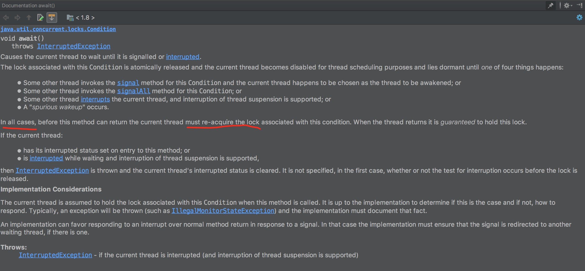

# 2020-10-17

今天在复习BitMap数据结构在java中的实现BitSet时，看到了3个有关位图的运算，需要自己思考几分钟，下面特意记录下：

* In function wordIndex, use 'index >> ADDRESS_BITS_PER_WORD' to get the index of in words in which ADDRESS_BITS_PER_WORD = 6.

why can use >> instead of divide operation ?

Because the divisor is the integral multiple of 2， we use >> to improve the  performance.
Of course using dividing is right, but performance is bad. Let's make a testing.

```
public class BitMapTestor {
    private static final Logger LOG = LoggerFactory.getLogger(BitMapTestor.class);

    private final static int ADDRESS_BITS_PER_WORD = 6;
    private final static int BITS_PER_WORD = 1 << ADDRESS_BITS_PER_WORD;

    @Test
    public void testBitOperations() {
        int bitIndex = 75;
        int indexByDvide = bitIndex / BITS_PER_WORD;
        int indexByBitOp = bitIndex >> ADDRESS_BITS_PER_WORD;
        Assert.assertEquals(indexByBitOp, indexByDvide);
    }
}
```
The testing is passed.

* In function wordIndex, use '1L << ADDRESS_BITS_PER_WORD' to get the word bit of indexing.

'<<' operation can left moving number over number's size like sliding window.

Let's make a testing.
```
public class BitMapTestor {
    private static final Logger LOG = LoggerFactory.getLogger(BitMapTestor.class);

    private final static int ADDRESS_BITS_PER_WORD = 6;
    private final static int BITS_PER_WORD = 1 << ADDRESS_BITS_PER_WORD;

    @Test
    public void testBitOperations() {
        int v = 1 << 33;
        LOG.info("1 << 33 is {}", v);
        Assert.assertEquals(2, v);
    }
}

```
The testing is passed.

* In function clear, use 'long lastWordMask  = WORD_MASK >>> -toIndex;' to do unsigned moving the bit from left to right.

```
long firstWordMask = WORD_MASK << fromIndex;
        long lastWordMask  = WORD_MASK >>> -toIndex;
        if (startWordIndex == endWordIndex) {
            // Case 1: One word
            words[startWordIndex] &= ~(firstWordMask & lastWordMask);
        } else {
            // Case 2: Multiple words
            // Handle first word
            words[startWordIndex] &= ~firstWordMask;

            // Handle intermediate words, if any
            for (int i = startWordIndex+1; i < endWordIndex; i++)
                words[i] = 0;

            // Handle last word
            words[endWordIndex] &= ~lastWordMask;
        }
```

It's too awesome to implement make (, end) to be zero like below.

```

--------------*              *---------------
0000000000000 | 111111111111 | 00000000000000
--------------*--------------*--------------->
             end            start
```


# 2020-08-26

总结一下最近几天看AQS-ConditionObject的认知变化。从问题角度出发

## 为什么waiting-queue中的线程被interrupted后，还需要先获取lock ？

首先：这个JDK 规范，可以参照Condition.wait 方法的说明




## 为什么waiting-queue中的线程被interrupted后，需要区分是在signal 之前还是之后？

## 为什么waiting-queue中的线程被interrupted后，并且是在signal之前，仅执行enq操作(将该node放入sync-queue)，不执行remove from waiting-queue？

## await方法中，当线程释放掉锁后(fullRelease)， 可能和后来拿到锁的线程有并发问题 ？

