# 2020-11-22

## java.no.Buffer

最近在看netty，netty中性能快很大一部分因为要归于buffer的优化。同时项目最近在对mult-part/form-data的读取进行优化。于是重新对java.nio.Buffer进行了回顾

java.nio.Buffer 中常用的class的结构如下图所示

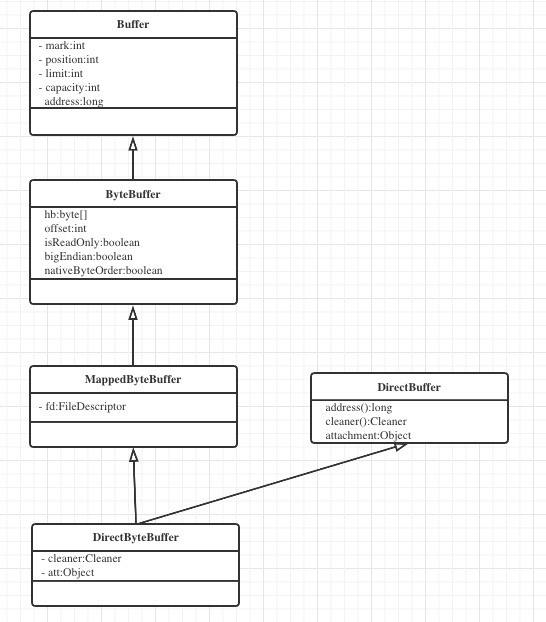

MappedByteBuffer 本质就是 DirectByteBuffer，他们都是在 `用户态` 申请的 `native heap memory` ,
在MappedByteBuffer的构造 (Mapped byte buffers are created via the {@link java.nio.channels.FileChannel#map FileChannel.map} method) 中可以发现：

MappedByteBuffer的构造是使用DirectByteBuffer的构造函数进行反射创建的
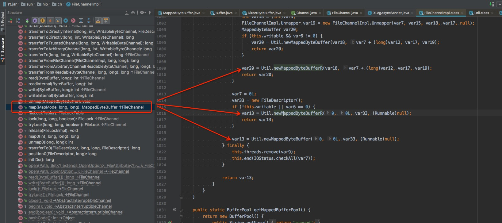

如果对用户态和内核态有歧义的，可以参考：https://www.zhihu.com/question/376317973

### 为什么 MappedByteBuffer 读取文件更快

MappedByteBuffer 是基于 mmap，通过将文件通过 `MMU` 映射到 虚拟内存地址上，通过DMA直接将文件和用户态的内存进行交互（本质是都是 2个区块内存地址的读写）。

节省了内核态的一次copy，也不需要CPU的介入。

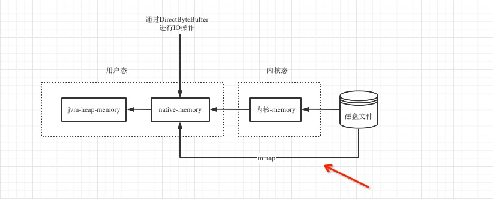

### 为什么 DirectByteBuffer 相比 HeapByteBuffer 快

任何的快都是相对的，必须要在明确对比场景。

* 场景1 ：和 Channel 配合使用，比如：SocketChannel、FileChannel

JDK对于Channel的写入、读取操作，使用了 native memory heap 作为中间过渡，大致流程如下图所示：
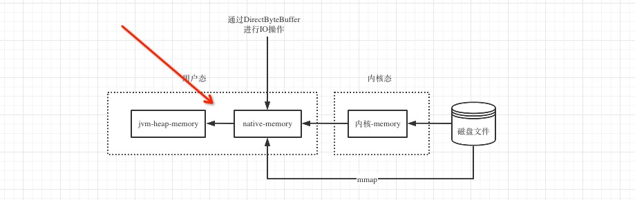

如果使用HeapByteBuffer，则会先读取到 DirectByteBuffer（内部动态生成）, 再copy到HeapByteBuffer中；如何直接使用DirectByteBuffer，可以避免一次copy。
具体的逻辑可以通过Channel的代码来确认：

下面跟踪到的代码 FileChannelImpl.read > FileChannelImpl.readInternal > IOUtil.read
```
static int read(FileDescriptor var0, ByteBuffer var1, long var2, NativeDispatcher var4) throws IOException {
	if (var1.isReadOnly()) {
		throw new IllegalArgumentException("Read-only buffer");
	} else if (var1 instanceof DirectBuffer) {
		return readIntoNativeBuffer(var0, var1, var2, var4);
	} else {
		ByteBuffer var5 = Util.getTemporaryDirectBuffer(var1.remaining()); //----------- 读取到的buffer是非DirectByteBuffer，则先申请直接内存

		int var7;
		try {
			int var6 = readIntoNativeBuffer(var0, var5, var2, var4);       //----------- 然后，在将从DirectByteBuffer copy 到 HeapByteBuffer
			var5.flip();
			if (var6 > 0) {
				var1.put(var5);
			}

			var7 = var6;
		} finally {
			Util.offerFirstTemporaryDirectBuffer(var5);
		}

		return var7;
	}
}
```

这个是JDK 的编码逻辑，非通用的逻辑

* 场景2：仅用在内存的cache功能

如果仅仅一次性的使用，双方效果差别不大，可能在GC 有些差异

DirectByteBuffer 和 MappedByteBuffer 是JVM 堆中对象，通过指针来管理在 native-heap-memory 中申请内存区域

# 2020-10-27

## AQS 之 cancelAcquire() 方法分析

在acquireQueued方法中，如果 tryAcquire() 抛出RuntimeException 或者 Error， 则会进入 cancelAcquire() 逻辑

```
final boolean acquireQueued(final Node node, int arg) {
        boolean failed = true;
        try {
            boolean interrupted = false;
            for (;;) {
                final Node p = node.predecessor();
                if (p == head && tryAcquire(arg)) {
                    setHead(node);
                    p.next = null; // help GC
                    failed = false;
                    return interrupted;
                }
                if (shouldParkAfterFailedAcquire(p, node) &&
                    parkAndCheckInterrupt())
                    interrupted = true;
            }
        } finally {
            if (failed)
                cancelAcquire(node); ----------- 取消逻辑
        }
    }
```

cancelAcquire()的主要工作是：
* 将该节点置为：Cancelled
* 在next 指针上，将该节点跳过

理想情况下，执行cancelAcquire()后，sync 队列的状况如下：
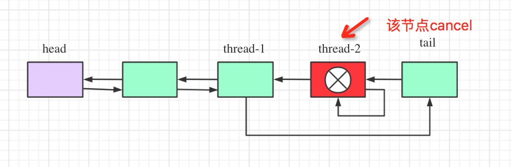

但是如果出现多个线程在被interrupted后，执行tryAcquire()后，都抛出异常，会有并发问题么 ？？？？？
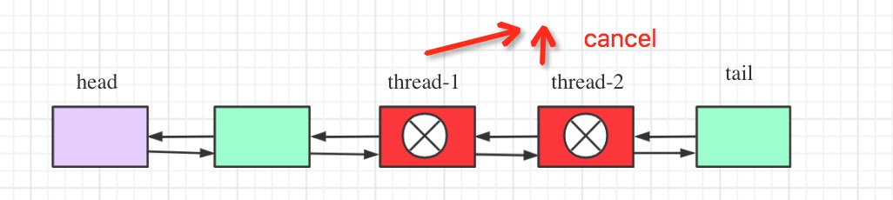

这个时候需要分场景讨论：

### 场景1

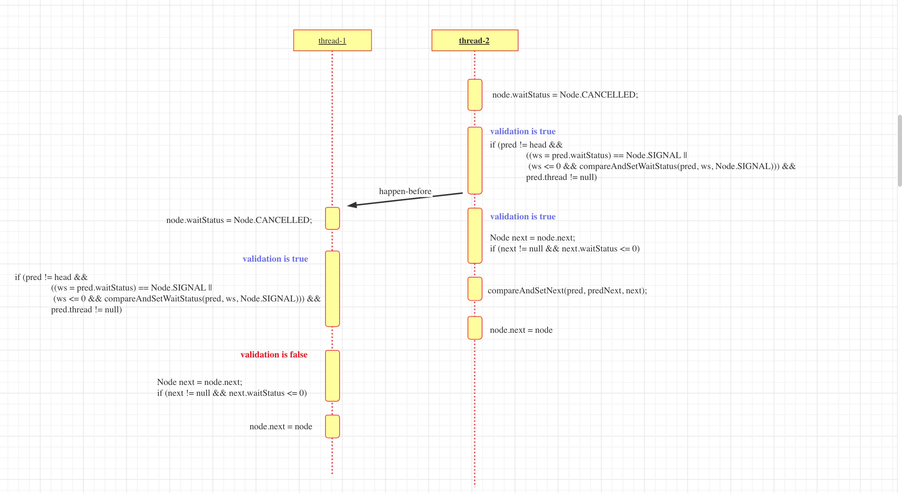

最终同步队列的结果：


### 场景2

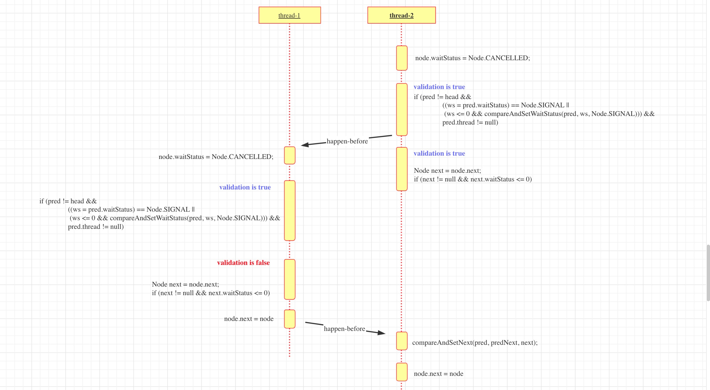

最终同步队列的结果：


### 场景3

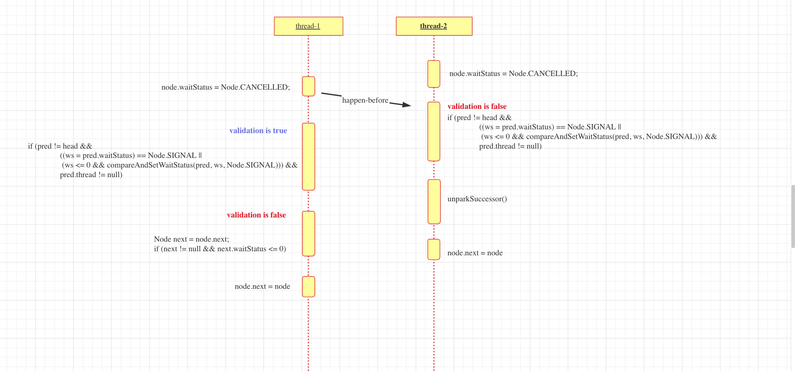

最终同步队列的结果：


可以看到，三种不同的场景，最终得到的链表结构是一样的。

这里有一个问题，结果的链表2个节点的next都指向的自己，next断链了 ！！！！！ 那在release的时候后
会受到影响么 ？

例如：到了如下的状态，持有锁的线程调用`release()`方法

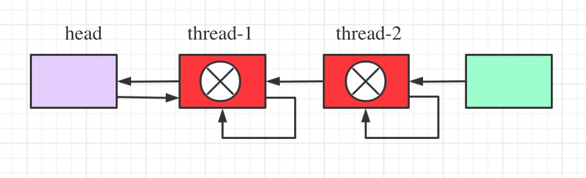

不会的 ！

在release的逻辑中，如果发现 head.next.waitStatus > 0, 则从tail 往前遍历，找到里head最近的非cancelled
节点。

```
private void unparkSuccessor(Node node) {
	/*
	 * If status is negative (i.e., possibly needing signal) try
	 * to clear in anticipation of signalling.  It is OK if this
	 * fails or if status is changed by waiting thread.
	 */
	int ws = node.waitStatus;
	if (ws < 0)
		compareAndSetWaitStatus(node, ws, 0);

	/*
	 * Thread to unpark is held in successor, which is normally
	 * just the next node.  But if cancelled or apparently null,
	 * traverse backwards from tail to find the actual
	 * non-cancelled successor.
	 */
	Node s = node.next;
	if (s == null || s.waitStatus > 0) {
		s = null;
		for (Node t = tail; t != null && t != node; t = t.prev)
			if (t.waitStatus <= 0)
				s = t;
	}
	if (s != null)
		LockSupport.unpark(s.thread); // -------- 这里 unpark
}
```

在unpark后，线程被唤醒，继续执行acuireQueued()内的循环逻辑。但是在acquireQueued()中，会先判断predecessor
是否为header。这样岂不有问题，改线程还是无法拿到锁？

```
final boolean acquireQueued(final Node node, int arg) {
	boolean failed = true;
	try {
		boolean interrupted = false;
		for (;;) {
			final Node p = node.predecessor();
			if (p == head && tryAcquire(arg)) { // ------------ 判断predecessor
				setHead(node);
				p.next = null; // help GC
				failed = false;
				return interrupted;
			}
			if (shouldParkAfterFailedAcquire(p, node) && //--------- 注意:shouldParkAfterFailedAcquire
				parkAndCheckInterrupt())
				interrupted = true;
		}
	} finally {
		if (failed)
			cancelAcquire(node);
	}
}
```

我们在看下：`shouldParkAfterFailedAcquire()`，在其内部会通过`pre` 跳过前置cancelled的节点，
找到header或者非cancelled节点后，重置起`next`，来实现跳过的操作。

```
private static boolean shouldParkAfterFailedAcquire(Node pred, Node node) {
	int ws = pred.waitStatus;
	if (ws == Node.SIGNAL)
		/*
		 * This node has already set status asking a release
		 * to signal it, so it can safely park.
		 */
		return true;
	if (ws > 0) {
		/*
		 * Predecessor was cancelled. Skip over predecessors and
		 * indicate retry.
		 */
		do {
			node.prev = pred = pred.prev;
		} while (pred.waitStatus > 0);
		pred.next = node; //------------------------- 注意这个逻辑
	} else {
		/*
		 * waitStatus must be 0 or PROPAGATE.  Indicate that we
		 * need a signal, but don't park yet.  Caller will need to
		 * retry to make sure it cannot acquire before parking.
		 */
		compareAndSetWaitStatus(pred, ws, Node.SIGNAL);
	}
	return false;
}
```
该方法执行后，队列的状况为：

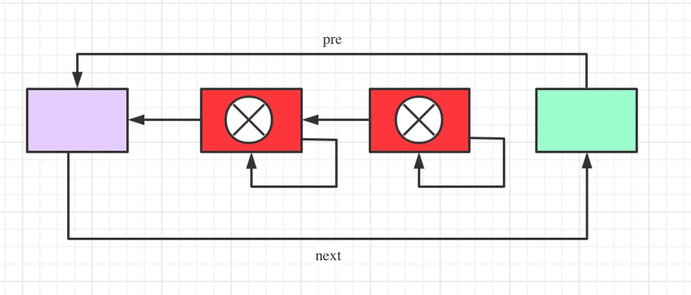

然后再循环执行`acquireQueued()`中的逻辑，就满足了。

之前有同事问：release > uparkSuccessor 内部为什么会有 从tail倒着遍历的逻辑，这里的分析可以解释。


# 2020-10-22

## 位运算之 Shift-Operator (左移、右移、无符号右移)

在Java的Specification中，定义了 shift operator 右边的数据会根据左边变量的类型，而截取不同的bit
* 如果左边是Int型，则右边支取低5位，相当于是：`& 0x1F`
* 如果昨天是Long型，则右边只取低6位，相当于是：`& 0x3F`

所以会有如下场景：

* 2 << 33 相当于 2 << (33 & 0x1F) then 2 << 1
* 2 << -30 相当于 2 << (-30 & 0x1F) then 2 << 2

参考资料： https://docs.oracle.com/javase/specs/jls/se15/html/jls-15.html#jls-15.19

摘录一下specification中的段落：
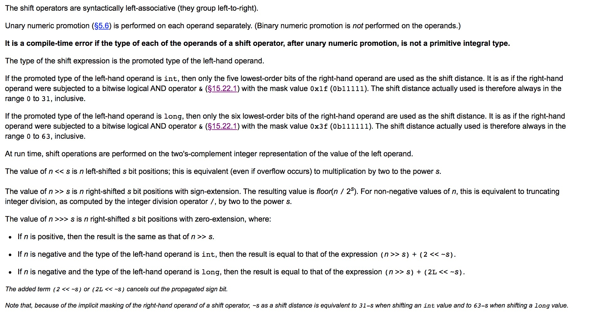


# 2020-10-17

## java.util.BitSet 阅读随笔

今天在复习BitMap数据结构在java中的实现BitSet时，看到了3个有关位图的运算，需要自己思考几分钟，下面特意记录下：

* In function wordIndex, use 'index >> ADDRESS_BITS_PER_WORD' to get the index of in words in which ADDRESS_BITS_PER_WORD = 6.

why can use >> instead of divide operation ?

Because the divisor is the integral multiple of 2， we use >> to improve the  performance.
Of course using dividing is right, but performance is bad. Let's make a testing.

```
public class BitMapTestor {
    private static final Logger LOG = LoggerFactory.getLogger(BitMapTestor.class);

    private final static int ADDRESS_BITS_PER_WORD = 6;
    private final static int BITS_PER_WORD = 1 << ADDRESS_BITS_PER_WORD;

    @Test
    public void testBitOperations() {
        int bitIndex = 75;
        int indexByDvide = bitIndex / BITS_PER_WORD;
        int indexByBitOp = bitIndex >> ADDRESS_BITS_PER_WORD;
        Assert.assertEquals(indexByBitOp, indexByDvide);
    }
}
```
The testing is passed.

* In function wordIndex, use '1L << ADDRESS_BITS_PER_WORD' to get the word bit of indexing.

'<<' operation can left moving number over number's size like sliding window.

Let's make a testing.
```
public class BitMapTestor {
    private static final Logger LOG = LoggerFactory.getLogger(BitMapTestor.class);

    private final static int ADDRESS_BITS_PER_WORD = 6;
    private final static int BITS_PER_WORD = 1 << ADDRESS_BITS_PER_WORD;

    @Test
    public void testBitOperations() {
        int v = 1 << 33;
        LOG.info("1 << 33 is {}", v);
        Assert.assertEquals(2, v);
    }
}

```
The testing is passed.

* In function clear, use 'long lastWordMask  = WORD_MASK >>> -toIndex;' to do unsigned moving the bit from left to right.

```
long firstWordMask = WORD_MASK << fromIndex;
        long lastWordMask  = WORD_MASK >>> -toIndex;
        if (startWordIndex == endWordIndex) {
            // Case 1: One word
            words[startWordIndex] &= ~(firstWordMask & lastWordMask);
        } else {
            // Case 2: Multiple words
            // Handle first word
            words[startWordIndex] &= ~firstWordMask;

            // Handle intermediate words, if any
            for (int i = startWordIndex+1; i < endWordIndex; i++)
                words[i] = 0;

            // Handle last word
            words[endWordIndex] &= ~lastWordMask;
        }
```

It's too awesome to implement make (, end) to be zero like below.

```

--------------*              *---------------
0000000000000 | 111111111111 | 00000000000000
--------------*--------------*--------------->
             end            start
```


## Bit operation 随笔

有两个问题：
* 如何对一个int型数字取反
* 如何对一个int型数字部分bit取反

下面分别讨论：

### 如何对一个int型数字取反

有两个办法：

* 第一种办法：通过位运算取反 ~
* 第二种办法：用过异或

```
int v = 0x89F0;
Assert.assertEquals(~v, v ^ 0xFFFFFFFF);
```

### 如何对一个int型数字部分bit取反

这个时候取反不满足要求，可以采用异或的办法。例如：

```
@Test
    public void testBitOperations2() {
        int v = 0x89F0;
        /**
         * 相比取反，异或方式更具有灵活性，可以只针对部分bit取反。
         *
         * 用于异或的数字，对应需要取反的部分都是1，其余是0
         * 例如：将第3、4、5 位的bit取反，可以这样
         *
         * -------------*     *-----
         * 000000000000 | 111 | 000
         * -------------*-----*-----
         *              ^     ^
         *              |     |
         *             end   start
         */
        int mask = 0xFFFFFFFF;
        int startMask = mask << 3;
        int endMask = mask >>> (32 - 6);
        int complementMask = startMask & endMask;

        Assert.assertEquals(0x89c8, v ^ complementMask);

        /**
         * 或者逐步异或
         */
        Assert.assertEquals(0x89c8, v ^ (1 << 3) ^ (1 << 4) ^ (1 << 5));
    }
```

异或是如何实现取反的操作？

下面拿1个bit来讨论：
* 1个bit无论它的值是0还是1，对1取异或都是取的反；
* 1个bit无论它的值是0还是1，对0取异或都是它自身


# 2020-08-26

总结一下最近几天看AQS-ConditionObject的认知变化。从问题角度出发

## 为什么waiting-queue中的线程被interrupted后，还需要先获取lock ？

首先：这个JDK 规范，可以参照Condition.wait 方法的说明


## 为什么waiting-queue中的线程被interrupted后，需要区分是在signal 之前还是之后？

## 为什么waiting-queue中的线程被interrupted后，并且是在signal之前，仅执行enq操作(将该node放入sync-queue)，不执行remove from waiting-queue？

## await方法中，当线程释放掉锁后(fullRelease)， 可能和后来拿到锁的线程有并发问题 ？

